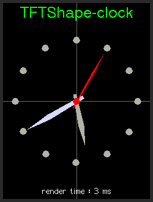

# TFTShape
TFTShape is an extension  to draw shape-based objects on screen. The target of this extension is to abstract low level primitives but with full use of the TFT_eSPI core functions (no setPixel operations). Shapes are graphical objects with the most common 2D functionality such as draw, fill, scale and rotate. Shapes consists of vertices which will be interpteted by the TFTShape class to form points, lines, polygons etc. Vertices can be user defined or they can be generated by various TFTShape  builder functions. To give you an overview, here is a short example to see how to use this extension:
## Building an analog clock
### clock-face
To draw a clock face, only three lines of code will be needed. The basic idea is to define a 12-sided polygon and draw a small dot on the vertices of the polygon. Fortunately TFTShape has the functionality not only to draw the shape itself but it can take also an argument to draw another shape (at all vertices positions). So the code is very simple: create a shape used for the 5 minutes dots, create a shape for an invisible grid and finally draw this grid with a Shape as an argument:
```javascript
  TFTShape dot=TFTShape::buildNgon(8,6); //generate an Oktogon with a radius of 6 
  TFTShape grid5minutes=TFTShape::buildNgon(12,100); //generate a Dodekagon with a radius of 100
  grid5minutes.fill(&tft,120,160,dot,TFT_GREY); //place grid at 120/160 and draw/fill all vertices with the dot-shape 

```
Note: filling functions using the  fastDrawXXX functions of the TFT_eSPI Api.
And this is the result of this code:


### clock hands
To draw a realistic clock hand, which should not be a single line and the anchor should not be exactly on one end of the hand, we design here a pentagon and scale this in one direction to our needs. Furthermore, because all of the TFTShape builder functions generate symmetrical shapes with the anchor point at the center, we need to move this anchor point (pivot point) nearly to the end of the hand.

  

Here you can see the phases of building a clock hand: source shape, resize shape, move shape

```javascript
  int pivy=35; //new pivot point for rotation and scaling
  TFTShape hand=TFTShape::buildNgon(5,60); // generate a pentagon with a radius of 60
  hand.setScale(.08,.8); //scale down the width to .08 and also shorten the hand  with a facor of .8
  hand.setPivot(0,pivy); //set the pivot point
```
Now it's time to rotate the hand to the desired position. Lets assume, we want to show the hour hand for 5:40:05, we have to rotate about 170 degrees. After then we can draw the hour hand with one of the drawing methods of TFTShape.
```javascript
  hand.setRotation(170); //set the rotation to 170 degrees 
  hand.fill(&tft,120,160-pivy,TFT_GREY); //draw an fill the hand. 
```
  

Repeating the steps above for the minutes and seconds hand and we are ready. And here is the complete code for drawing the analog clock:
```javascript
  TFTShape dot=TFTShape::buildNgon(8,6);
  TFTShape grid5minutes=TFTShape::buildNgon(12,100);
  //clock-face 
  grid5minutes.fill(&tft2,120,160,dot,TFT_GREY);
  int pivy=35;
  //hour-hand
  TFTShape hand=TFTShape::buildNgon(5,60);
  hand.setScale(.08,.8); hand.setPivot(0,pivy); hand.setRotation(170);
  hand.fill(&tft2,120,160-pivy,TFT_GREY);
  //minutes-hand
  hand.setScale(.08,1); hand.setRotation(240);
  hand.fill(&tft2,120,160-pivy,TFT_LIGHTGREY);
  //seconds-hand
  hand.setScale(.03,1); hand.setRotation(30); 
  hand.fill(&tft2,120,160-pivy,TFT_RED);
  dot.fill(&tft2,120,160,TFT_RED);
  dot.setScale(.4);
  dot.fill(&tft2,120,160,TFT_DARKGREY);
```

